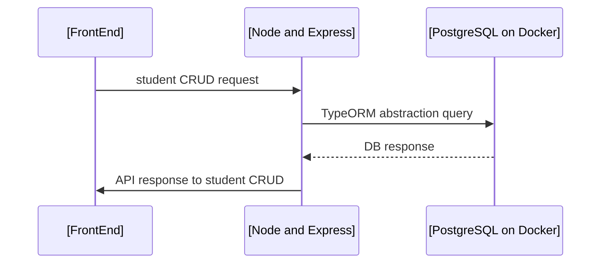

# Documenting the API and Interface of the Full Stack Web challenge

## API - Node.JS + Express

The sources for the API can be found [here](aca-api). It requires Docker and Node.JS.

Any request made from the client goes to the API and from there, TypeORM is used instead of directly querying the database. A draft of a sequence diagram illustrates such and interaction.  


The `student CRUD request` can be seen as one of the API requests described in the routes below.
### API Routes for the Application

| Method | Route                 | Description                                              |
|--------|-----------------------|----------------------------------------------------------|
| GET    | `/student`            | List all students                                        |
| GET    | `/student/:ra`        | List one student with a provided `ra` (academic regitry) |
|POST    | `/student/create`     | Create a new student                                     |
|POST    | `/student/update/:ra` |  Edit a student matching a provided `ra`                 |
|DELETE  | `/student/:ra`        | Delete a student matching a provided `ra`                |


Next, I present what I did and what could be done with a bit more of time.

### What I did

- I wrote a simple API using Node with [Express](https://www.npmjs.com/package/express)
- I used Docker in order to create an instance of Postgres
- I used [TypeORM](https://www.npmjs.com/package/typeorm) for manipulating data from Postgres using the OO paradigm
  - In case of using MongoDB, I'd go for [Mongoose](https://www.npmjs.com/package/mongoose)
- I used [Yup](https://www.npmjs.com/package/yup) for parsing and validating the data coming from `request` in the API.
### What I could've done if I had more time

- I could use [JWT](https://www.npmjs.com/package/jwt) for securing the connection, however, it would involve adding a login page, 
and bit more of work for securing the routes. And as it was not in the requirements, I'm just commenting out.

- I wish I had more time for providing some unit tests. In order to do so, I could use [Jest](https://www.npmjs.com/package/jest).

## Interface in Vue.JS

Giving that this was my first experience with Vue.JS, I did enjoy the challenge, although I wish I had more time to learn Vue.JS and improve my code.

### What I did

- I used [Vuetify](https://vuetifyjs.com/en/) as much as I could
- The app use a already available skeleton of the page, with left drawer with a sandwich button.
- I used CSS a few times for a bit of adjustments in the layout, but not too much
- For the modal, I followed an example from the Vue.JS docs.
- If no items are found after API request, a "Nenhum registro acadêmico cadastrado" message is displayed and the search bar is hidden.
- Added a field validation with regex for CPF and Email to the frontend:
  - For the CPF, we are able to capture the ###.###.###-## pattern, no matter how the user inputs it (with or without dots and dash)
  - For the email, the user must pay attention to the forbidden characters, followed by the `@` and then with an accepted domain (using the regex)

### What I could've done if I had more time

- I could not understand too much of Vuetify manual styling with CSS, and therefore I could not reproduce the design of the form inputs as requested.
  - I'm don't use much of UI libraries in my codes. I'm more used to have a Figma design for a system and develop components tailored for that system.

# To run the frontend

## 1 - Project setup
```
yarn install
```
or
```
npm run install
```

then, run it in development mode.
### 2 - Compiles and hot-reloads for development
```
yarn serve
```
or
```
npm run serve
```
